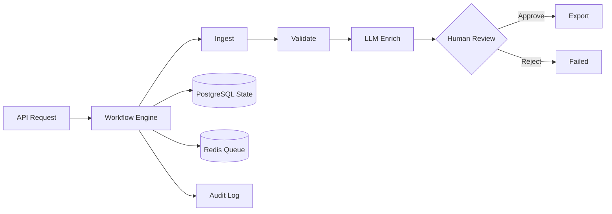
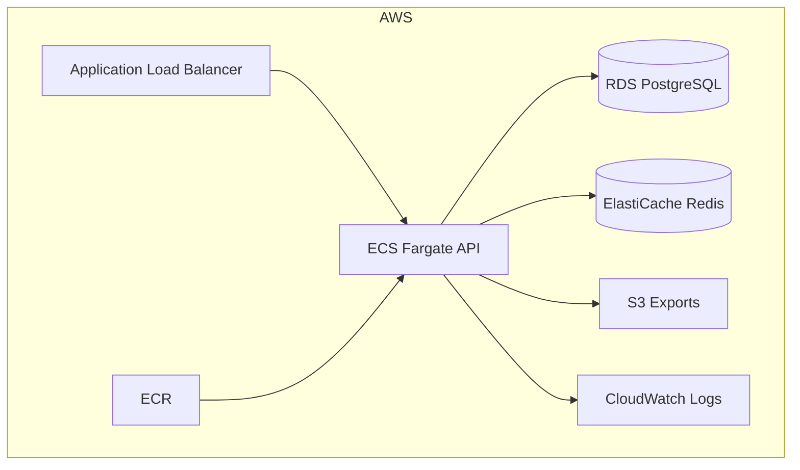
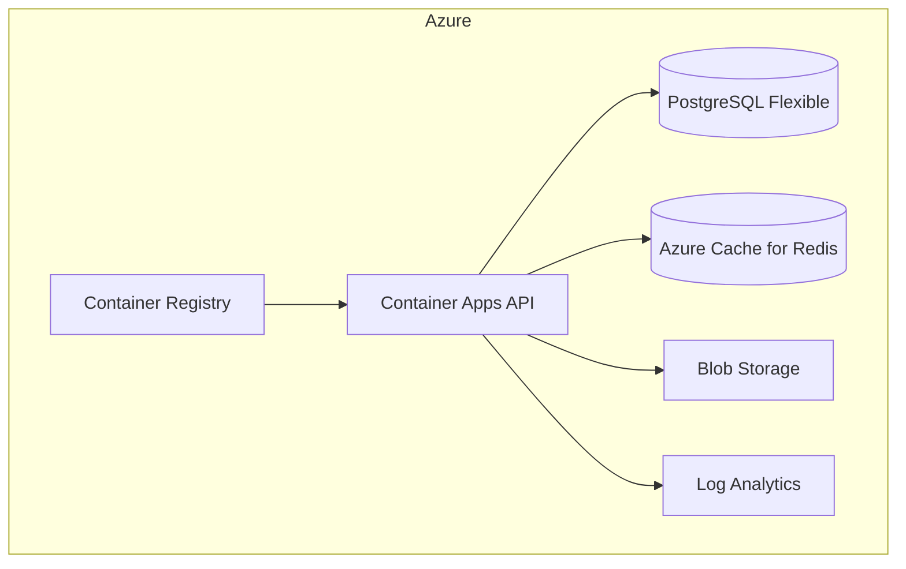

# Ananya Cloud AI Orchestration Platform

**Orchestrate multi-day AI workflows across AWS and Azure** — with PostgreSQL state, Redis queues, human review gates, and production infra included.

[](https://github.com/Ananyanagaraj11/ananya-cloud-ai-orchestration-platform/actions)


---

## 30-second pitch

> AI labs need **long-running pipelines** (ingest → model → human expert → export) that don't lose state, don't double-charge on retries, and survive failures.  
> This repo is a **workflow engine + cloud blueprint** — the same patterns used at frontier data and enterprise AI companies.

**Try locally in 60 seconds** → [Quick start](#-quick-start)

---

## What you get

| Layer | What's included |
|-------|-----------------|
| **Application** | FastAPI workflow engine · idempotency · retries · HITL · audit log · Prometheus |
| **AWS** | Terraform: **ECS Fargate**, **RDS PostgreSQL**, **ElastiCache Redis**, **S3**, **ECR**, **CloudWatch** |
| **Azure** | Terraform: **Container Apps**, **PostgreSQL Flexible**, **Azure Cache for Redis**, **Blob Storage**, **ACR** |
| **Kubernetes** | Deployment + Service + **HPA** (EKS / AKS ready) |
| **Ops** | Docker Compose · GitHub Actions CI · `/health` · `/metrics` |

---

## Architecture

### Workflow engine (cloud-agnostic)



### AWS production stack



| AWS Service | Role |
|-------------|------|
| **ECS Fargate** | Run FastAPI workflow API |
| **RDS PostgreSQL** | Persistent workflow + step state |
| **ElastiCache Redis** | Async job queue |
| **S3** | Export artifacts |
| **ECR** | Container images |
| **CloudWatch** | Logs + container insights |
| **IAM** | Least-privilege task roles |

→ Terraform: [`infra/terraform/aws/`](infra/terraform/aws/)

### Azure production stack



| Azure Service | Role |
|---------------|------|
| **Container Apps** | Serverless API hosting + autoscale |
| **PostgreSQL Flexible** | Workflow state |
| **Azure Cache for Redis** | Job queue |
| **Blob Storage** | Export artifacts |
| **ACR** | Container registry |
| **Log Analytics** | Centralized observability |

→ Terraform: [`infra/terraform/azure/`](infra/terraform/azure/)

---

## Repo map

```
├── src/
│   ├── api/main.py           # FastAPI — /workflows, /health, /metrics
│   ├── workflow/engine.py    # State machine, retries, HITL
│   └── storage/database.py   # SQLAlchemy persistence
├── infra/
│   ├── terraform/aws/        # ECS + RDS + Redis + S3 + ECR
│   ├── terraform/azure/      # Container Apps + PostgreSQL + Redis
│   └── kubernetes/           # Deployment, Service, HPA
├── docs/
│   ├── ARCHITECTURE.md
│   ├── AWS-DEPLOY.md
│   └── AZURE-DEPLOY.md
├── dashboard/                # Streamlit ops UI
├── docker-compose.yml        # Local Postgres + Redis stack
└── tests/                    # pytest
```

---

## Quick start

```bash
git clone https://github.com/Ananyanagaraj11/ananya-cloud-ai-orchestration-platform
cd ananya-cloud-ai-orchestration-platform
python -m venv .venv && .venv\Scripts\activate   # Windows
pip install -e ".[dev]"
uvicorn src.api.main:app --reload --port 8040
```

Open **http://localhost:8040/docs** → `POST /workflows`

```bash
curl -X POST http://localhost:8040/workflows \
  -H "Content-Type: application/json" \
  -d "{\"idempotency_key\":\"demo-1\",\"input_payload\":{\"batch\":\"eval-run\"}}"
```

---

## Deploy to cloud

### AWS (Terraform)

```bash
cd infra/terraform/aws
cp terraform.tfvars.example terraform.tfvars   # edit credentials
terraform init && terraform plan && terraform apply
docker build -t $ECR_URL:latest .
docker push $ECR_URL:latest
# Wire ECS service to task definition (see docs/AWS-DEPLOY.md)
```

### Azure (Terraform)

```bash
cd infra/terraform/azure
cp terraform.tfvars.example terraform.tfvars
az login
terraform init && terraform plan && terraform apply
```

### Kubernetes (EKS / AKS)

```bash
kubectl apply -f infra/kubernetes/deployment.yaml
```

Full runbooks: [`docs/AWS-DEPLOY.md`](docs/AWS-DEPLOY.md) · [`docs/AZURE-DEPLOY.md`](docs/AZURE-DEPLOY.md)

---

## Live demo (Render)

[](https://render.com/deploy?repo=https://github.com/Ananyanagaraj11/ananya-cloud-ai-orchestration-platform)

| Service | URL |
|---------|-----|
| API | https://ananya-cloud-ai-orchestration-platform.onrender.com/docs |
| Dashboard | https://ananya-cloud-orchestration-dashboard.onrender.com |

> Render = quick public demo. **Production target = AWS or Azure Terraform above.**

---

## Distributed systems patterns

| Pattern | Implementation |
|---------|----------------|
| **Idempotency** | `idempotency_key` → same workflow run returned |
| **Retries** | Tenacity on step execution (3 attempts, exponential backoff) |
| **Long-running jobs** | State persisted in PostgreSQL between steps |
| **Human-in-the-loop** | Workflow pauses at `awaiting_human` until `/approve` |
| **Audit trail** | Append-only event log per run |
| **Observability** | Prometheus counters + K8s scrape annotations |

---

## Testing

```bash
pytest tests -q          # 4 tests
ruff check src tests
```

---

## Author

**Ananya Naga Raj** — AI/Backend Engineer · [GitHub](https://github.com/Ananyanagaraj11) · [LinkedIn](https://www.linkedin.com/in/ananyanagaraj/)

MIT License
